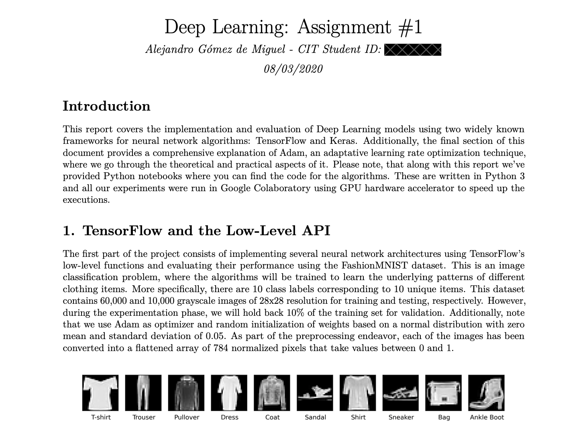
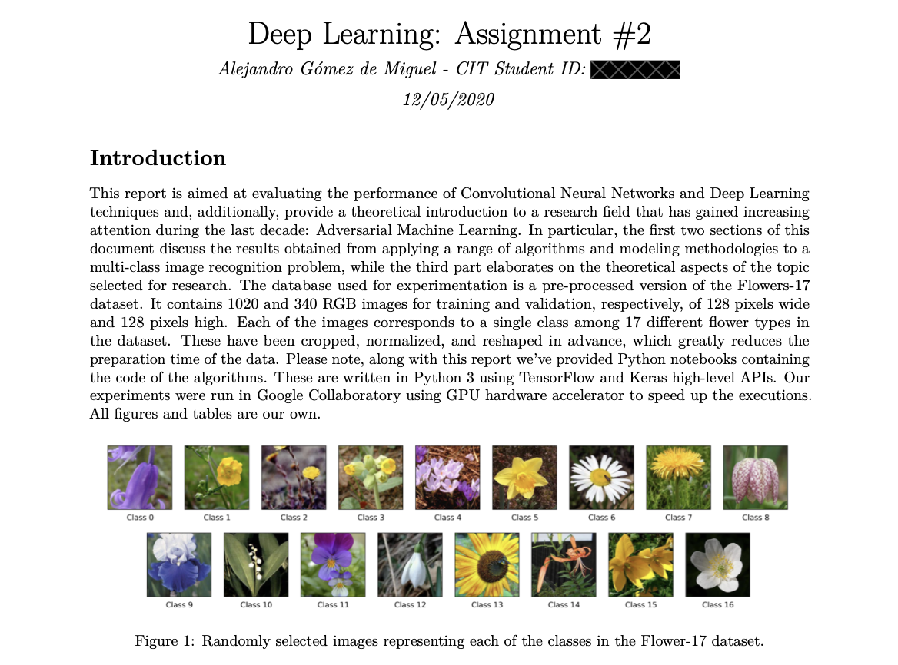

## Overview

This is an in-depth introduction to Deep Learning, from linear regression with gradient descent to convolutional neural nets.

The code files here are mainly labs and assignments I submitted as part of the course in Deep Learning at Munster Technological University by Dr. Ted Scully.

I believe this is a great intro to Deep Learning for anyone who wants to get started on coding neural networks using TensorFlow and Keras, as well as understanding the main idea behind these algorithms.

`linear_regression` and `multiple_linear_regression` are implemented from scratch using gradient descent and tested on toy data.

`deep_neural_nets` and `convolutional_neural_nets` apply neural networks to image classification problems and they cover:

- Multi-class classification
- Adam Optimizer
- Activation functions
- L1 & L2 regularization
- Dropout
- Data augmentation
- Ensembles
- Hybrid NN + ML algorithms
- Transfer learning
- Feature extraction
- Fine tuning
- Batch normalization
- Intro to adversarial machine learning

## Reports

